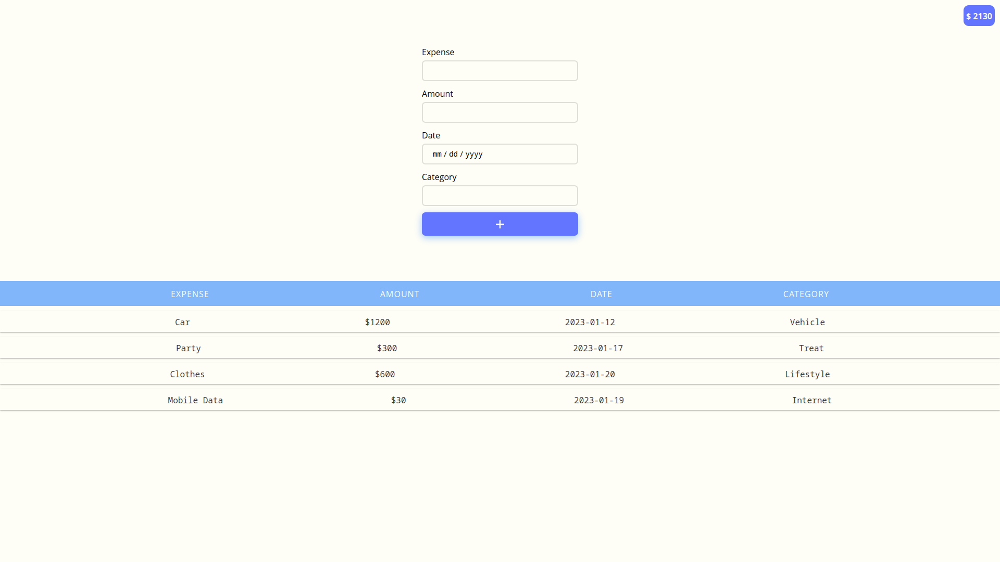

# Expense Tracker App

This expense tracker app allows users to keep track of their expenses by recording the amount, date, and description of each expense. The app is built using HTML, CSS, and JavaScript and it uses the `localStorage` API to store data locally on the user's device.

## Features
- Add new expenses 
- View a list of all expenses
- View total expenses 

## More Details
- The app uses `localStorage` to store the expenses data on the user's device.
- The app uses JavaScript to handle events and update the UI.
